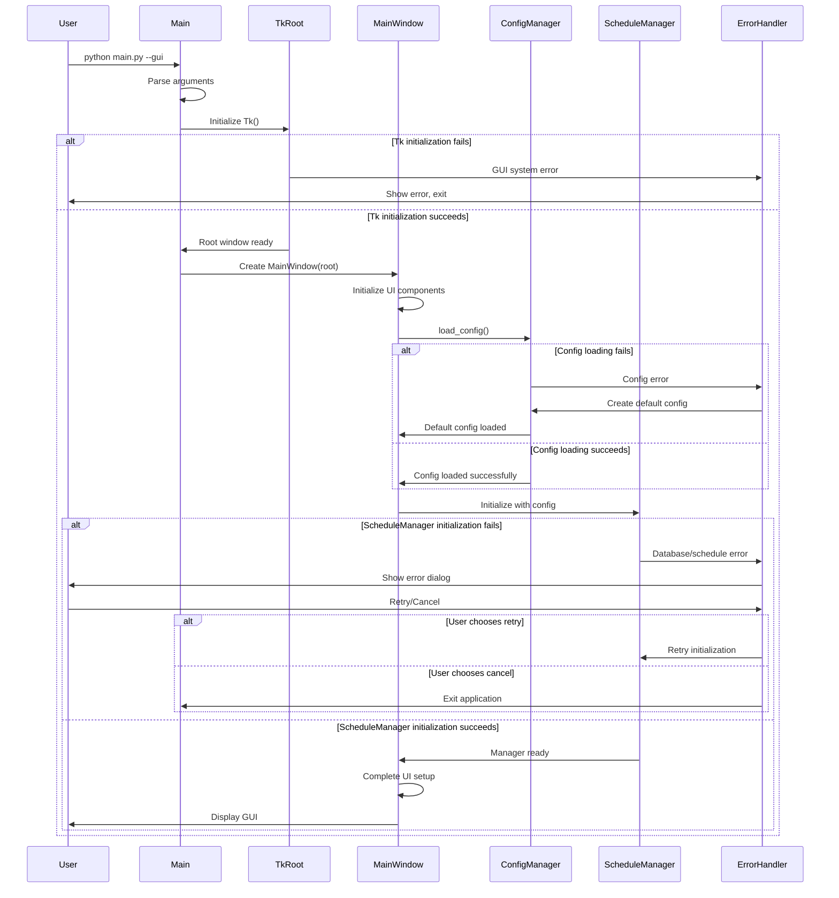

# GUI Launch Process

## Overview

The GUI Launch Process defines how the application transitions from command-line startup to a fully functional graphical user interface. This process encompasses entry point detection, component initialization sequencing, configuration loading, and comprehensive error handling.

## 1. Entry Point Logic

The application supports both GUI and CLI modes, with the entry point logic determining the execution path based on command-line arguments or default behavior.

### Detection Methods

**Option A: Flag-based Detection (Recommended)**
```python
# Command line examples:
python main.py --gui          # Launch GUI mode
python main.py --cli          # Launch CLI mode  
python main.py               # Default behavior (configurable)
```

**Option B: Always GUI (Simplified)**
```python
# GUI is the default and primary interface
# CLI tools available as separate utilities
```

### Implementation Strategy

The entry point uses `argparse` to detect the `--gui` flag and route execution accordingly. If no flag is specified, the application defaults to GUI mode for better user experience.

## 2. Initialization Order

The GUI initialization follows a strict sequence to ensure proper component dependencies and error handling:

```
1. Tk Root Creation
2. MainWindow Instantiation  
3. Child Component Creation
4. Configuration Loading (load_config())
5. ScheduleManager Instantiation
6. Final UI Setup & Display
```

### Detailed Sequence

1. **Tk Root Creation**: Initialize the root Tkinter window with basic properties
2. **MainWindow Instantiation**: Create the main application window framework
3. **Child Component Creation**: Initialize UI components (menus, frames, widgets)
4. **Configuration Loading**: Load user preferences and application settings via `load_config()`
5. **ScheduleManager Instantiation**: Initialize the scheduling system with loaded configuration
6. **Final UI Setup**: Complete layout, bind events, and display the window

## 3. Startup Error Handling

The application implements comprehensive error handling for various failure scenarios during startup.

### Error Categories

| Error Type | Description | Recovery Action |
|------------|-------------|-----------------|
| **Missing Config** | Configuration file not found | Create default config, show first-run wizard |
| **Corrupted Config** | Configuration file corrupted/invalid | Backup corrupted file, create new default config |
| **Schedule DB Unavailable** | Database connection failed | Show error dialog, offer to recreate DB |
| **Permission Errors** | File/directory access denied | Show permission error, suggest solutions |
| **Dependency Missing** | Required libraries not available | Show dependency error, installation guide |
| **GUI System Error** | Tkinter/display issues | Graceful fallback to CLI mode |

### Error Handling Flowchart

```
Start Application
       |
   Parse Arguments
       |
   ┌─────────────┐
   │ GUI Mode?   │
   └─────┬───────┘
         │ Yes
   Initialize Tk Root
         |
   ┌─────────────┐
   │ Tk Success? │
   └─────┬───────┘
         │ Yes
   Create MainWindow
         |
   ┌─────────────┐
   │ Window OK?  │
   └─────┬───────┘
         │ Yes
   Load Configuration
         |
   ┌─────────────┐
   │ Config OK?  │
   └─────┬───────┘
         │ Yes
   Initialize ScheduleManager
         |
   ┌─────────────┐
   │ Manager OK? │
   └─────┬───────┘
         │ Yes
   Launch GUI
         |
      Success!

   Error Paths:
   ├─ No GUI Mode → Launch CLI
   ├─ Tk Failed → Show Error, Exit
   ├─ Window Failed → Show Error, Exit  
   ├─ Config Failed → Create Default + Continue
   └─ Manager Failed → Show Error, Retry Option
```

## 4. High-Level Sequence Diagram



## 5. Revised main.py Code Example

```python
#!/usr/bin/env python3
"""
Main entry point for the Schedule Manager application.
Supports both GUI and CLI modes with comprehensive error handling.
"""

import argparse
import sys
import tkinter as tk
from tkinter import messagebox
import logging
from pathlib import Path

# Import application modules
from gui.main_window import MainWindow
from core.config_manager import ConfigManager, ConfigError
from core.schedule_manager import ScheduleManager, ScheduleError
from cli.cli_interface import CLIInterface

# Configure logging
logging.basicConfig(
    level=logging.INFO,
    format='%(asctime)s - %(name)s - %(levelname)s - %(message)s'
)
logger = logging.getLogger(__name__)

class ApplicationLauncher:
    """Handles application startup and initialization."""
    
    def __init__(self):
        self.root = None
        self.main_window = None
        self.config_manager = None
        self.schedule_manager = None
        
    def parse_arguments(self):
        """Parse command line arguments."""
        parser = argparse.ArgumentParser(
            description='Schedule Manager - Task Scheduling Application'
        )
        parser.add_argument(
            '--gui', 
            action='store_true', 
            default=True,
            help='Launch in GUI mode (default)'
        )
        parser.add_argument(
            '--cli', 
            action='store_true',
            help='Launch in CLI mode'
        )
        parser.add_argument(
            '--debug', 
            action='store_true',
            help='Enable debug logging'
        )
        
        return parser.parse_args()
    
    def setup_logging(self, debug=False):
        """Configure application logging."""
        level = logging.DEBUG if debug else logging.INFO
        logging.getLogger().setLevel(level)
        logger.info(f"Logging configured at level: {level}")
    
    def initialize_gui_components(self):
        """Initialize GUI components in the correct order."""
        try:
            # Step 1: Create Tk root
            logger.info("Initializing Tk root window...")
            self.root = tk.Tk()
            self.root.withdraw()  # Hide initially
            
            # Step 2: Create MainWindow
            logger.info("Creating MainWindow...")
            self.main_window = MainWindow(self.root)
            
            # Step 3: Load configuration
            logger.info("Loading configuration...")
            self.config_manager = ConfigManager()
            config = self.config_manager.load_config()
            
            # Step 4: Initialize ScheduleManager
            logger.info("Initializing ScheduleManager...")
            self.schedule_manager = ScheduleManager(config)
            
            # Step 5: Complete initialization
            logger.info("Completing GUI setup...")
            self.main_window.set_schedule_manager(self.schedule_manager)
            self.main_window.finalize_setup()
            
            return True
            
        except tk.TclError as e:
            logger.error(f"Tkinter initialization failed: {e}")
            self.show_error("GUI System Error", 
                          f"Failed to initialize GUI system:\n{e}")
            return False
            
        except ConfigError as e:
            logger.warning(f"Configuration error: {e}")
            if self.handle_config_error(e):
                return self.initialize_gui_components()  # Retry
            return False
            
        except ScheduleError as e:
            logger.error(f"Schedule manager error: {e}")
            return self.handle_schedule_error(e)
            
        except Exception as e:
            logger.error(f"Unexpected error during GUI initialization: {e}")
            self.show_error("Initialization Error", 
                          f"Unexpected error:\n{e}")
            return False
    
    def handle_config_error(self, error):
        """Handle configuration-related errors."""
        if "not found" in str(error).lower():
            logger.info("Configuration file not found, creating default...")
            try:
                self.config_manager.create_default_config()
                return True
            except Exception as e:
                logger.error(f"Failed to create default config: {e}")
                return False
        
        elif "corrupted" in str(error).lower():
            logger.info("Configuration file corrupted, backing up and creating new...")
            try:
                self.config_manager.backup_corrupted_config()
                self.config_manager.create_default_config()
                return True
            except Exception as e:
                logger.error(f"Failed to handle corrupted config: {e}")
                return False
        
        return False
    
    def handle_schedule_error(self, error):
        """Handle schedule manager initialization errors."""
        response = messagebox.askyesno(
            "Schedule Database Error",
            f"Failed to initialize schedule database:\n{error}\n\n"
            "Would you like to try recreating the database?"
        )
        
        if response:
            try:
                self.schedule_manager.recreate_database()
                logger.info("Database recreated successfully")
                return True
            except Exception as e:
                logger.error(f"Failed to recreate database: {e}")
                self.show_error("Database Recreation Failed", str(e))
                return False
        
        return False
    
    def show_error(self, title, message):
        """Show error dialog to user."""
        if self.root:
            messagebox.showerror(title, message)
        else:
            print(f"ERROR - {title}: {message}")
    
    def launch_gui(self):
        """Launch the GUI application."""
        if not self.initialize_gui_components():
            logger.error("GUI initialization failed")
            return False
        
        try:
            logger.info("Starting GUI main loop...")
            self.root.deiconify()  # Show window
            self.root.mainloop()
            return True
        
        except KeyboardInterrupt:
            logger.info("Application interrupted by user")
            return True
        
        except Exception as e:
            logger.error(f"GUI runtime error: {e}")
            self.show_error("Runtime Error", str(e))
            return False
    
    def launch_cli(self):
        """Launch the CLI interface."""
        try:
            logger.info("Starting CLI interface...")
            cli = CLIInterface()
            cli.run()
            return True
        
        except Exception as e:
            logger.error(f"CLI error: {e}")
            print(f"CLI Error: {e}")
            return False
    
    def cleanup(self):
        """Clean up resources before exit."""
        if self.schedule_manager:
            self.schedule_manager.cleanup()
        if self.root:
            self.root.quit()

def main():
    """Main entry point."""
    launcher = ApplicationLauncher()
    
    try:
        # Parse arguments
        args = launcher.parse_arguments()
        
        # Setup logging
        launcher.setup_logging(args.debug)
        
        # Determine launch mode
        if args.cli:
            success = launcher.launch_cli()
        else:
            success = launcher.launch_gui()
        
        # Exit with appropriate code
        sys.exit(0 if success else 1)
        
    except KeyboardInterrupt:
        logger.info("Application interrupted")
        sys.exit(0)
    
    except Exception as e:
        logger.error(f"Fatal error: {e}")
        sys.exit(1)
    
    finally:
        launcher.cleanup()

if __name__ == "__main__":
    main()
```

## 6. Best Practices

### Error Recovery
- Always provide meaningful error messages to users
- Implement graceful degradation when possible
- Log errors for debugging while showing user-friendly messages
- Offer recovery options (retry, reset, recreate) when appropriate

### Configuration Management
- Create sensible defaults when configuration is missing
- Validate configuration data before use
- Backup corrupted configurations before replacing
- Version configuration files for future migration

### Resource Management
- Properly cleanup resources on exit
- Handle interrupted startup gracefully
- Implement timeout mechanisms for long-running operations
- Use context managers where appropriate

### User Experience
- Show progress indicators during initialization
- Provide clear feedback for all error conditions
- Offer help and documentation links in error dialogs
- Remember user preferences for error handling choices

This GUI Launch Process ensures reliable application startup with comprehensive error handling and clear user feedback throughout the initialization sequence.
