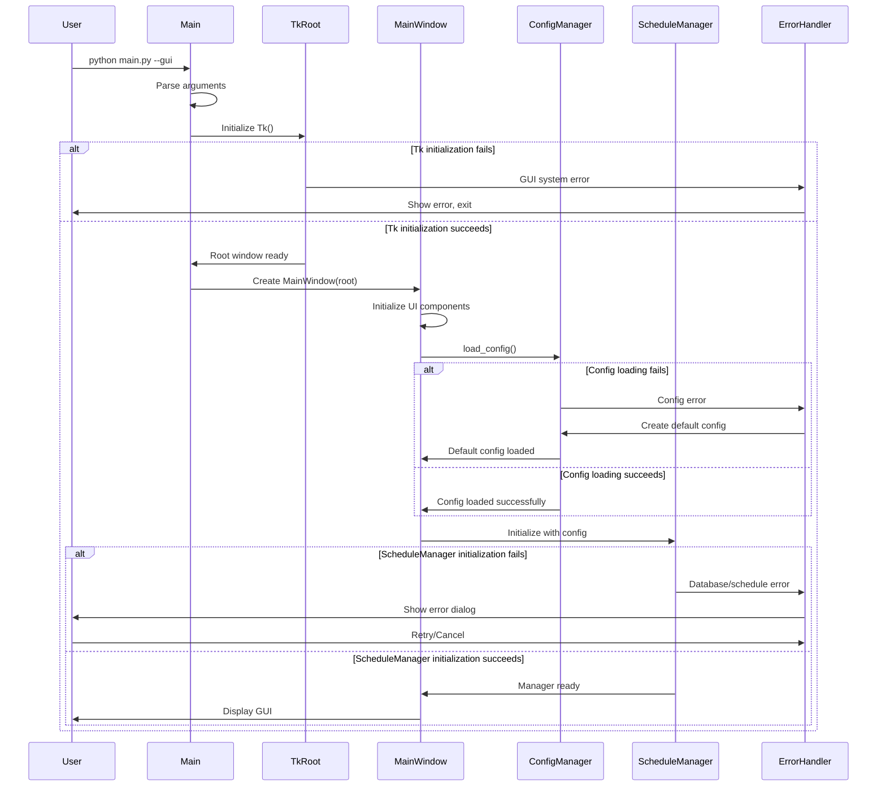

# GUI Launch Documentation

## Overview

This document describes the comprehensive process for launching and configuring the GUI for Cinder's Web Scraper. It encompasses entry point detection, component initialization sequencing, configuration loading, and error handling strategies.

## Table of Contents

1. [Entry Point Logic](#1-entry-point-logic)
2. [Initialization Sequence](#2-initialization-sequence)
3. [Error Handling](#3-error-handling)
4. [Code Examples](#4-code-examples)
5. [Configuration Management](#5-configuration-management)
6. [Troubleshooting](#6-troubleshooting)
7. [Future Work](#7-future-work-todos)

## 1. Entry Point Logic

The application supports both GUI and CLI modes, with intelligent detection based on command-line arguments.

### Usage Examples

```bash
# Launch GUI mode (default)
python main.py --gui

# Launch CLI mode
python main.py --cli

# Default behavior (GUI mode)
python main.py

# Enable debug logging
python main.py --debug
```

### Implementation Strategy

The entry point uses `argparse` to detect execution mode and route accordingly. If no flag is specified, the application defaults to GUI mode for better user experience.

```python
def parse_arguments():
    parser = argparse.ArgumentParser(
        description='Schedule Manager - Task Scheduling Application'
    )
    parser.add_argument('--gui', action='store_true', default=True,
                       help='Launch in GUI mode (default)')
    parser.add_argument('--cli', action='store_true',
                       help='Launch in CLI mode')
    parser.add_argument('--debug', action='store_true',
                       help='Enable debug logging')
    return parser.parse_args()
```

## 2. Initialization Sequence

The GUI initialization follows a strict sequence to ensure proper component dependencies:

```
1. Tk Root Creation
2. MainWindow Instantiation  
3. Child Component Creation
4. Configuration Loading (load_config())
5. ScheduleManager Instantiation
6. Final UI Setup & Display
```

### Detailed Process

1. **Tk Root Creation**: Initialize the root Tkinter window with basic properties
2. **MainWindow Instantiation**: Create the main application window framework
3. **Child Component Creation**: Initialize UI components (menus, frames, widgets)
4. **Configuration Loading**: Load user preferences and application settings
5. **ScheduleManager Instantiation**: Initialize the scheduling system
6. **Final UI Setup**: Complete layout, bind events, and display the window

### Current Implementation

```python
class MainWindow:
    def __init__(self, root: tk.Tk):
        self.root = root
        self.status_var = tk.StringVar(value="Ready")
        self._setup_ui()
    
    def _setup_ui(self):
        self.root.title("Cinder's Web Scraper")
        # Create menu bar, toolbar, and main components
        self._create_menu()
        self._create_toolbar()
        self._create_main_content()
        self._create_status_bar()
```

## 3. Error Handling

The application implements comprehensive error handling for various failure scenarios during startup.

### Error Categories

| Error Type | Description | Recovery Action |
|------------|-------------|-----------------|
| **Missing Config** | Configuration file not found | Create default config, show first-run wizard |
| **Corrupted Config** | Configuration file corrupted/invalid | Backup corrupted file, create new default config |
| **Schedule DB Unavailable** | Database connection failed | Show error dialog, offer to recreate DB |
| **Permission Errors** | File/directory access denied | Show permission error, suggest solutions |
| **Dependency Missing** | Required libraries not available | Show dependency error, installation guide |
| **GUI System Error** | Tkinter/display issues | Graceful fallback to CLI mode |

### Error Handling Flow



## 4. Code Examples

### Basic CLI Entry Point

```python
def main() -> None:
    """Run the simple command-line scheduler demo."""
    manager = ScheduleManager()
    
    if not manager.list_tasks():
        manager.add_task("dummy", dummy_job, 5)
    
    logger.log("Scheduler started. Press Ctrl+C to exit.")
    try:
        while True:
            manager.run_pending()
            time.sleep(1)
    except KeyboardInterrupt:
        logger.log("Scheduler stopped.")
    finally:
        manager.close()
```

### GUI Window Setup

```python
def _setup_ui(self) -> None:
    """Create all UI components."""
    self.root.title("Cinder's Web Scraper")
    
    # Menu bar
    menubar = tk.Menu(self.root)
    file_menu = tk.Menu(menubar, tearoff=0)
    file_menu.add_command(label="Exit", command=self.root.quit)
    menubar.add_cascade(label="File", menu=file_menu)
    self.root.config(menu=menubar)
    
    # Toolbar with action buttons
    toolbar = ttk.Frame(self.root)
    ttk.Button(toolbar, text="Add Site", 
              command=self._on_manage_sites).pack(side=tk.LEFT, padx=2)
    ttk.Button(toolbar, text="Start Scraping", 
              command=self._start_scraping).pack(side=tk.LEFT, padx=2)
    toolbar.pack(fill=tk.X)
    
    # Main content area
    self._create_site_list()
    self._create_action_buttons()
    self._create_status_bar()
```

### Enhanced Main Entry Point (Future Implementation)

```python
class ApplicationLauncher:
    """Handles application startup and initialization."""
    
    def initialize_gui_components(self):
        """Initialize GUI components in the correct order."""
        try:
            # Step 1: Create Tk root
            self.root = tk.Tk()
            self.root.withdraw()  # Hide initially
            
            # Step 2: Create MainWindow
            self.main_window = MainWindow(self.root)
            
            # Step 3: Load configuration
            self.config_manager = ConfigManager()
            config = self.config_manager.load_config()
            
            # Step 4: Initialize ScheduleManager
            self.schedule_manager = ScheduleManager(config)
            
            # Step 5: Complete initialization
            self.main_window.set_schedule_manager(self.schedule_manager)
            self.main_window.finalize_setup()
            
            return True
            
        except Exception as e:
            self.handle_initialization_error(e)
            return False
```

## 5. Configuration Management

### Configuration Loading

```python
def load_config(path: str = DEFAULT_CONFIG_PATH) -> Dict[str, Any]:
    """Load configuration from JSON file with fallback to defaults."""
    try:
        with open(path, "r", encoding="utf-8") as fp:
            config = json.load(fp)
        logger.log(f"Loaded configuration from {path}")
        return config
    except FileNotFoundError:
        logger.log(f"Configuration file not found: {path}")
        return DEFAULT_CONFIG.copy()
    except json.JSONDecodeError:
        logger.log(f"Invalid JSON in configuration: {path}")
        return DEFAULT_CONFIG.copy()
```

### Configuration Structure

```json
{
  "websites": [
    {
      "name": "Example Site",
      "url": "https://example.com",
      "selectors": {
        "title": "h1",
        "content": ".content"
      },
      "interval": 3600
    }
  ],
  "settings": {
    "debug": false,
    "output_dir": "output/",
    "max_workers": 4
  }
}
```

## 6. Troubleshooting

### Common Issues

1. **GUI won't start**
   - Verify Python version (3.8+)
   - Check Tkinter installation: `python -c "import tkinter"`
   - Try CLI mode: `python main.py --cli`

2. **Configuration errors**
   - Delete `data/websites.json` to regenerate defaults
   - Check file permissions in `data/` directory
   - Verify JSON syntax in configuration files

3. **Scheduling issues**
   - Check database permissions: `data/schedules.db`
   - Verify system time and timezone settings
   - Review logs in `data/logs/`

### Debug Mode

Enable debug logging for detailed troubleshooting:

```bash
python main.py --debug
```

## 7. Future Work (TODOs)

### High Priority
- [ ] Implement comprehensive `ApplicationLauncher` class
- [ ] Add first-run setup wizard for new users
- [ ] Implement graceful fallback to CLI mode on GUI failures
- [ ] Add configuration file validation and migration

### Medium Priority
- [ ] Complete `WebsiteManager` GUI component
- [ ] Implement `SchedulerDialog` for task management
- [ ] Add progress indicators during initialization
- [ ] Implement auto-recovery for corrupted databases

### Low Priority
- [ ] Add splash screen during startup
- [ ] Implement plugin system for GUI extensions
- [ ] Add keyboard shortcuts for common actions
- [ ] Implement theme/appearance customization

### Component Development
- [ ] Complete `SettingsPanel` with all configuration options
- [ ] Implement `OutputManager` for data handling
- [ ] Add real-time log viewer in GUI
- [ ] Implement export/import functionality for configurations

### Testing & Documentation
- [ ] Add comprehensive unit tests for GUI components
- [ ] Create integration tests for initialization sequence
- [ ] Add user manual with screenshots
- [ ] Document keyboard shortcuts and accessibility features

## Architecture Diagram

```
┌─────────────────────────────────────────────────────────────────┐
│                        Application Entry Point                  │
│                           main.py                               │
└─────────────────────┬───────────────────────────────────────────┘
                      │
                      ▼
              ┌───────────────────┐
              │   Argument Parser │
              │   (--gui/--cli)   │
              └─────────┬─────────┘
                        │
           ┌────────────┴────────────┐
           ▼                         ▼
    ┌─────────────┐           ┌─────────────┐
    │ GUI Mode    │           │ CLI Mode    │
    │             │           │             │
    └─────────────┘           └─────────────┘
           │
           ▼
    ┌─────────────┐
    │ Tk Root     │
    │ Creation    │
    └─────────────┘
           │
           ▼
    ┌─────────────┐
    │ MainWindow  │
    │ Initialize  │
    └─────────────┘
           │
           ▼
    ┌─────────────┐
    │ Config      │
    │ Loading     │
    └─────────────┘
           │
           ▼
    ┌─────────────┐
    │ Schedule    │
    │ Manager     │
    └─────────────┘
           │
           ▼
    ┌─────────────┐
    │ GUI Launch  │
    │ Complete    │
    └─────────────┘
```

---

*This documentation is actively maintained and updated as the GUI implementation evolves. For the latest information, check the repository's commit history.*
